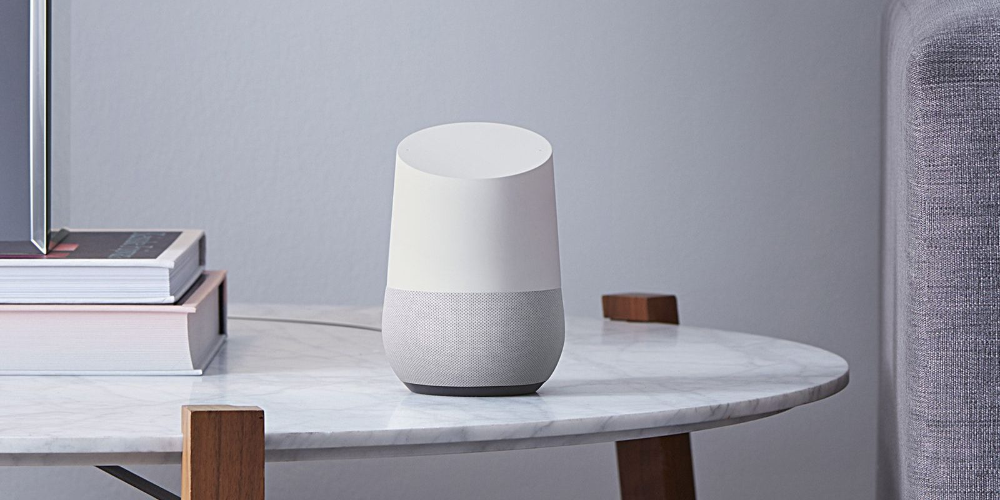
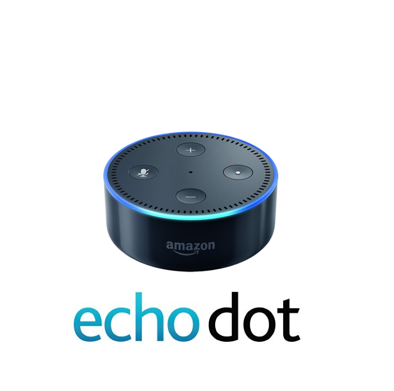

```{r setup, include=FALSE}
knitr::opts_chunk$set(echo = FALSE)
library(plyr)
library(devtools)
library(twitteR)
library(tidyverse)
library(streamR)
library(wordcloud)
library(tm)
library(SnowballC)
library(stringr)
library(RColorBrewer)
library(reshape2)
library(sentimentr)
library(ggplot2)
library(tidytext)
library(ggmap)
library(maptools)
library(maps)
library(gridExtra)
library(leaflet)
library(knitr)
```

## Introduction - What is Smart Home?

- Smart Home is building automation for a home. It involves the control and automation of lighting, heating (such as smart thermostats), ventilation, air conditioning (HVAC), and security, as well as home appliances such as washer/dryers, ovens or refrigerators/freezers. Wi-Fi is often used for remote monitoring and control. Home devices, when remotely monitored and controlled via the Internet, are an important constituent of the Internet of Things.

- This analysis compares two smart home product I like most, Google Home Mini and Echo Dot. 

- For more information, visit product webpage.\newline 
Google home: https://store.google.com/product/google_home \newline
Echo Dot:https://www.amazon.com/Amazon-Echo-Dot-Previous-Generation/b?ie=UTF8&node=14047587011 

## Google Home
Through Google Home I can get hands-free help from the Google Assistant. Get answers, play songs, tackle your day, enjoy your entertainment and control your smart home with just my voice.\newline

```{r echo=FALSE, out.width='30%'}

```

## Echo Dot
Amazon Echo (shortened and referred to as Echo) is a brand of smart speakers developed by Amazon.com. The devices connect to the voice-controlled intelligent personal assistant service Alexa, which responds to the name "Alexa". The device is capable of voice interaction, music playback, making to-do lists, setting alarms, streaming podcasts, playing audiobooks, and providing weather, traffic and other real-time information. It can also control several smart devices using itself as a home automation hub.\newline

```{r echo=FALSE, out.width='30%'}

```

## Word Cloud - "Smart Home"
```{r, echo=FALSE}
smarthome <- readRDS('SmartHome.rds')
smarthome$text <- iconv(smarthome$text,from = "latin1", to = "ASCII", sub = "")
## Create a corpus.
wordCorpus <- Corpus(VectorSource(str_replace_all(smarthome$text, "@","")))
## Convert the corpus to a plain text document.
wordCorpus <- tm_map(wordCorpus, PlainTextDocument)
## Remove all punctuation and stopwords.
wordCorpus <- tm_map(wordCorpus, removePunctuation)
wordCorpus <- tm_map(wordCorpus, content_transformer(tolower))
wordCorpus <- tm_map(wordCorpus, removeWords, stopwords('english'))
wordCorpus <- tm_map(wordCorpus, removeWords, c('the', 'this', stopwords('english')))
wordCorpus <- tm_map(wordCorpus, removeWords, c('smarthome'))

## Perform stemming.
wordCorpus <- tm_map(wordCorpus, stemDocument)

## Plot
set.seed(123)
wordcloud(wordCorpus, scale=c(5,0.5), max.words = 80, random.order = FALSE, rot.per=0.35, use.r.layout=FALSE, colors = brewer.pal(4, "Dark2"))
```

## Word Cloud - "Google Home"
```{r}
googlehome <- readRDS('googlehome.rds')
googlehome$text <- iconv(googlehome$text,from = "latin1", to = "ASCII", sub = "")
## Create a corpus.
wordCorpus2 <- Corpus(VectorSource(str_replace_all(googlehome$text, "@","")))
## Convert the corpus to a plain text document.
wordCorpus2 <- tm_map(wordCorpus2, PlainTextDocument)
## Remove all punctuation and stopwords.
wordCorpus2 <- tm_map(wordCorpus2, removePunctuation)
wordCorpus2 <- tm_map(wordCorpus2, content_transformer(tolower))
wordCorpus2 <- tm_map(wordCorpus2, removeWords, stopwords('english'))
wordCorpus2 <- tm_map(wordCorpus2, removeWords, c('the', 'this', stopwords('english')))
wordCorpus2 <- tm_map(wordCorpus2, removeWords, c('smarthome'))
wordCorpus2 <- tm_map(wordCorpus2, stemDocument)

## Plot
set.seed(123)
wordcloud(wordCorpus2, scale=c(5,0.5), max.words = 80, random.order = FALSE, rot.per=0.35, use.r.layout=FALSE, colors = brewer.pal(4, "Dark2"))
```

## Word Cloud - "Echo Dot"
```{r}
echodot <- readRDS('echodot.rds')
echodot$text <- iconv(echodot$text,from = "latin1", to = "ASCII", sub = "")
## Create a corpus.
wordCorpus1 <- Corpus(VectorSource(str_replace_all(echodot$text, "@","")))
## Convert the corpus to a plain text document.
wordCorpus1 <- tm_map(wordCorpus1, PlainTextDocument)
## Remove all punctuation and stopwords.
wordCorpus1 <- tm_map(wordCorpus1, removePunctuation)
wordCorpus1 <- tm_map(wordCorpus1, content_transformer(tolower))
wordCorpus1 <- tm_map(wordCorpus1, removeWords, stopwords('english'))
wordCorpus1 <- tm_map(wordCorpus1, removeWords, c('the', 'this', stopwords('english')))
wordCorpus1 <- tm_map(wordCorpus1, removeWords, c('smarthome'))
wordCorpus1 <- tm_map(wordCorpus1, stemDocument)
## Plot
set.seed(123)
wordcloud(wordCorpus1, scale=c(5,0.5), max.words = 80, random.order = FALSE, rot.per=0.35, use.r.layout=FALSE, colors = brewer.pal(4, "Dark2"))
```

## Sentiment analysis 
### Comparation between Google Home and Echo Dot
```{r}
result_echo <- readRDS('result_echo.rds')
result_google <- readRDS('result_google.rds')

bar_echo <- ggplot(result_echo,aes(result_echo$score))+geom_bar(width = 0.3, fill='orange') +labs(x="Sentiment score for Echo Dot")
bar_google <- ggplot(result_google,aes(result_google$score))+geom_bar(width = 0.3, fill='orange') +labs(x="Sentiment score for Google Home")

grid.arrange(bar_google, bar_echo, ncol=2)
```

The gragh above shows the setiment score of these two products. Apparently Amazon Echo is recieving more positive comments than Google Home. 

This is not a efficient analysis since most of comments have score zero. This shows that most of tweets didn't have any positive or negative comment.

## Time line
###Time line of the number of favourates and retweets of the topic "Smart Home" in one day.

```{r}
smarthome <- readRDS("SmartHome.rds")
smarthome$favoriteCount <- as.numeric(smarthome$favoriteCount)

timeline1 <- ggplot(smarthome, aes(x=created, y=favoriteCount)) +
  geom_line(col='orange')+labs(x="Time", y="Number of Favourates")
timeline2 <- ggplot(smarthome, aes(x=created, y=retweetCount)) +
  geom_line(col='orange')+ labs(x="Time", y="Number of Retweets")

grid.arrange(timeline1, timeline2, ncol=2)
```

## Map
### Location of tweets related to the topic "Smart Home" created.
```{r}
mapdata<-readRDS("smarthome_geo.rds")
mapdata$longitude<-as.numeric(mapdata$longitude)
mapdata$latitude<-as.numeric(mapdata$latitude)
x <- mapdata$longitude
y <- mapdata$latitude

map <- NULL
mapWorld <- borders("world", colour="light blue", fill="gray50") # create a layer of borders
map <- ggplot() +   mapWorld
map <- map+ geom_point(aes(x, y), data = mapdata ,color="orange", size=2) 
map

```


